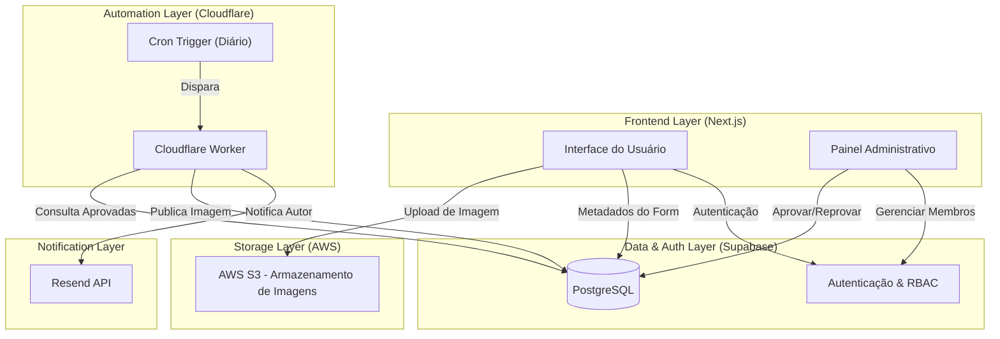
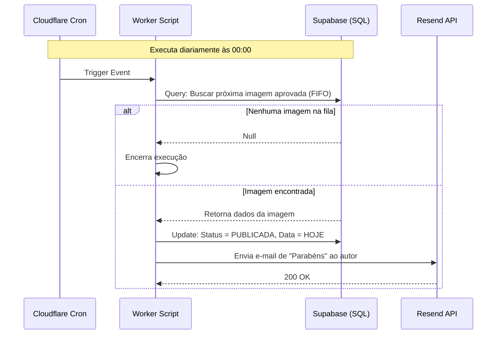

# ApodBrazil

> **Status:** Em produção (1+ ano) | **Imagens Publicadas:** 500+ | **Arquitetura:** Serverless & Custo Otimizado

## 📖 Visão Geral do Projeto

O **ApodBrazil** (Astronomy Picture of the Day Brazil) é uma plataforma comunitária dedicada a divulgar e catalogar astrofotografias tiradas no Brasil. O projeto foi reestruturado do zero para transformar um MVP não funcional em um sistema robusto, escalável e de baixo custo operacional.

O sistema gerencia todo o ciclo de vida do conteúdo: desde o envio da imagem pelo usuário (upload), passando por um sistema de curadoria com votação qualificada, até a publicação automática agendada e distribuição de notificações.

---

## 🏗️ Arquitetura do Sistema

A arquitetura foi desenhada seguindo o princípio de **Custo Zero/Baixo Custo**, utilizando serviços serverless e tiers gratuitos de provedores de nuvem, mantendo alta disponibilidade.

---

## 🛠️ Stack Tecnológico

* **Frontend:** Next.js (React) - Escolhido pela performance, SEO e facilidade de integração com APIs.
* **Banco de Dados:** PostgreSQL (via Supabase) - Armazenamento relacional de metadados, usuários e votos.
* **Autenticação:** Supabase Auth - Gerenciamento de sessões e controle de acesso (RBAC).
* **Storage:** AWS S3 - Armazenamento de objetos (imagens em alta resolução) com custo otimizado (centavos/mês).
* **Automação:** Cloudflare Workers - Computação serverless na borda para tarefas agendadas.
* **Email:** Resend - Disparo de e-mails transacionais.

---

## ⚙️ Módulos e Funcionalidades Técnicas

### 1. Sistema de Autenticação e Autorização (RBAC)

Implementação de controle de acesso baseado em funções para garantir a segurança da curadoria.

* **Roles:** Visitante, Usuário Registrado, Avaliador, Administrador.
* **Admin:** Capacidade exclusiva de adicionar ou revogar acesso de membros à equipe de avaliação.
* **Segurança:** Políticas de Row Level Security (RLS) no PostgreSQL garantem que apenas avaliadores acessem imagens pendentes.

### 2. Pipeline de Ingestão e Armazenamento Híbrido

Para otimizar custos e performance, adotou-se uma estratégia híbrida:

* **Upload:** O upload da imagem é feito diretamente para o AWS S3 (Presigned URLs) para evitar carga no servidor de aplicação.
* **Metadados:** Dados técnicos (equipamento, localização, dados EXIF) são normalizados e salvos no PostgreSQL.

### 3. Motor de Curadoria e Votação

O sistema possui uma lógica de aprovação baseada em consenso técnico:

1. Avaliadores acessam uma fila de imagens pendentes.
2. Critérios técnicos são aplicados (foco, ruído, composição).
3. O sistema calcula um *score* de aprovação. Imagens com **>70% de aprovação** entram automaticamente na fila de publicação.

### 4. Automação de Publicação (Cron Job)

Para eliminar a necessidade de intervenção humana diária, foi desenvolvido um worker autônomo.

### 5. Monetização e Sustentabilidade

Para cobrir os custos residuais de armazenamento (AWS S3), foi implementado um sistema de anúncios proprietário:

* **Gerenciamento:** Painel para configuração de banners e popups, permitindo troca dinâmica de patrocinadores sem deploy de código.
* **Frontend:** Componente de exibição não intrusivo injetado na aplicação.

---

## 🚀 Desafios e Soluções de Engenharia

| Desafio | Solução Implementada |
| --- | --- |
| **Custo de Infraestrutura** | Uso agressivo de Free Tiers (Supabase, Cloudflare) e S3 (storage classe standard/infrequent access). |
| **Engajamento** | Feedback automático via e-mail (Resend) assim que a imagem é publicada, fechando o ciclo de recompensa do usuário. |
| **Escalabilidade** | Separação entre Frontend (Vercel/Next) e Backend Logic (Serverless Functions), permitindo escalas independentes. |

---

## 📈 Impacto

* **Uptime:** >99.9% em mais de 1 ano de operação.
* **Volume:** Mais de 500 imagens processadas e publicadas.
* **Custo:** Operação mantida com custo próximo a zero, sustentada pela monetização implementada.

---

## 👨‍💻 Autor & Tech Lead

Arquitetura e Liderança Técnica por **João Marcos Jensen Francisco**.

[LinkedIn](https://www.linkedin.com/in/jo%C3%A3o-marcos-jensen-francisco/) | [Website](https://www.apodbrazil.com/)
